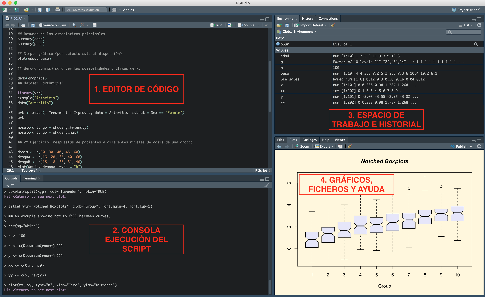
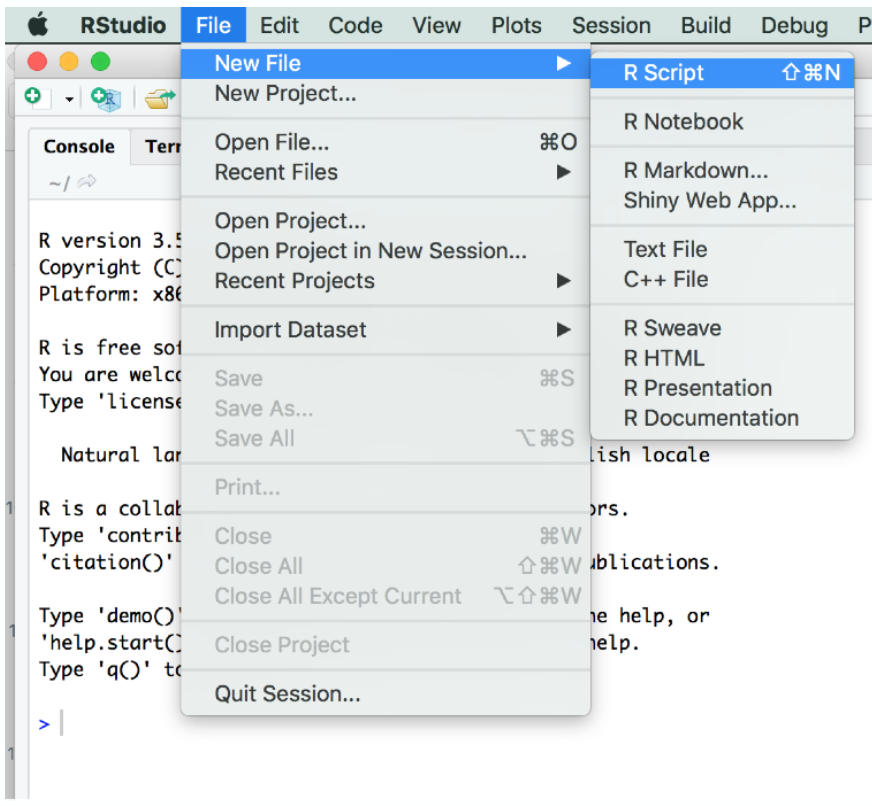
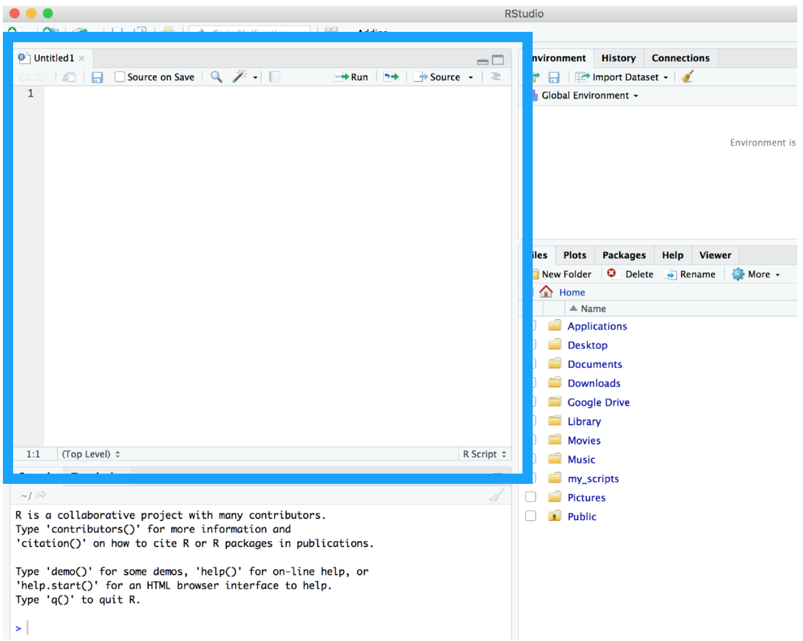
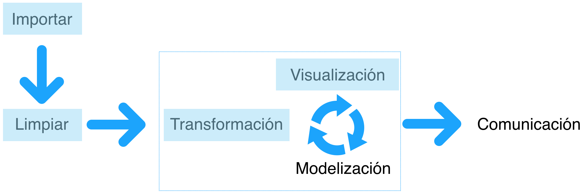

<style>
p.comment {
background-color: #DBDBDB;
padding: 10px;
border: 1px solid black;
margin-left: 25px;
border-radius: 5px;
font-style: italic;
}

</style>

** ** 
**Lugar y hora:** *Edif. Leonardo Da Vinci.* 

**Grupos y horas:** ***Grupo 2:*** *Lunes de 13:00 a 14:30;* ***Grupo 3:*** *Lunes de 15:30 a 17:00;* ***Grupo 1:*** *Martes de 08:00 a 09:30*

**Docente:** [***José R. Caro Barrera***](mailto:jrcaro@uco.es) 

[](http://uco.es)

***
		
# Parte 1: Introducción. Configuración del Entorno y Conceptos Básicos

1. Objetivos del curso
2. `R` y el entorno `Rstudio`
* 2.1. Interfaces de `R`
3. Conceptos básicos:
* 3.1. La "ayuda" en `R`.
* 3.2. Directorio o carpeta de trabajo. Localización y configuración.
* 3.3. Leer ficheros de texto.
* 3.4. Leer ficheros de hojas de cálculo.
* 3.5. Instalación de paquetes.
* 3.6. Usando `Rstudio` por primera vez. Introduciendo datos directamente.
* 3.7. Corriendo scripts.
4. Estructuras de datos en `R` (I)
* 4.1. Objetos, vectores y matrices.
* 4.2. Indexando vectores.
* 4.3. **Ejercicios:** operaciones con vectores
5. Estructuras de datos en `R`: data frames
* 5.1. Data frames.
* 5.2. **Ejercicios:** operaciones con data frames.
* 5.3. El operador 'pipe' `%>% `
7. Ejercicio final del módulo.

Referencias

## 1. Objetivos del curso

Se pretende que el alumno adquiera las siguientes habilidades:

<div class="alert alert-info">
  <strong>1)</strong> Instalar `R` y `Rstudio` desde el principio.
  
  <strong>2)</strong> Aprender a manejar la interfaz del programa y a moverse entre los distintos componentes y menús.
  
  <strong>3)</strong> Establecer los conceptos básicos y fundamentos de la estadística programando en R.
  
  <strong>4)</strong> Comprender la estructura de los datos: **observación** y **visualización**.
  
</div>

A medida que avanzamos es importante que el alumno pueda mantenerse al día si escribe, se toman notas y se practica al mismo tiempo que se avanza. El aprendizaje real ocurrirá cuando se intenten aplicar estos conceptos por cuenta propia, por ello se trabajará constamente con ejercicios.

## 2. `R` y el entorno `Rstudio` 

[](https://www.tidyverse.org/) 
[R para la ciencia de datos con `tidyverse`](https://www.tidyverse.org/) 

`R` es un lenguaje de programación, derivado de `S`, creado por Ross Ihaka y Robert Gentleman [@ihaka1993r] en la Universidad de Aukland, en 1993. Se puede encontrar el artículo original en: 

<https://www.stat.auckland.ac.nz/~ihaka/downloads/R-paper.pdf>

Para descargar e instalar la última versión del programa se puede hacer desde aquí:

[https://cran.r-project.org/](https://cran.r-project.org/) -- seleccione la que se ajuste a su sistema operativo.

`R` es simple y ligero. Es posible trabajar directamente en su consola, o incluso desde la terminal, pero en su lugar usaremos una aplicación muy fácil de usar para interactuar con ella, `Rstudio`, la cual se puede descargar e instalar en su última versión desde:

[https://www.rstudio.com/products/rstudio/download/](https://www.rstudio.com/products/rstudio/download/) -- de nuevo se ha de seleccionar aquella que se pueda ejecutar de acuerdo con el sistema operativo del ordenador donde se haya instalado `R`.


### 3.1. Interfaces de `R`

`Rstudio` es muchas cosas a la vez. Es un administrador de archivos, un editor de secuencias de comandos, un editor de documentos, una instancia de `R`, un visor de datos, incluso un navegador web. Aquí es donde haremos todo. Este documento, por ejemplo, está hecho con **markdown**, lo que nos permite mezclar código, salida y texto en un solo archivo y puede generar documentos en word, html o pdf.


`R` puede ser ejecutado desde la consola principal (o terminal). Existen, además otros interfaces que facilitan al usuario trabajar en `R` con un entorno gráfico más flexible y sencillo, como son R-Commander y R-Studio. Este último, en particular, se ha configurado como el más usado en los últimos años por su versatilidad, complementos y capacidades.

[](https://www.rstudio.com/products/rstudio/download/)

[](https://www.rstudio.com) [RStudio Cheatsheet](https://www.rstudio.com/wp-content/uploads/2016/10/r-cheat-sheet-3.pdf)


## 4. Conceptos Básicos

Ya hemos mencionado anteriormente que `R` es un lenguaje de programación, ahora añadiremos que es *funcional*. El término *funcional* implica que se puede pensar en funciones de diferentes formas, como por ejemplo, las usadas en matemáticas $f()$ o como pequeños programas, donde a la función se le da un input (datos, instrucciones,...) dicha función hace algo y devuelve un output. Por ejemplo:

```{r}
sum(1, 2, 3, 4)
```

### 4.1. La "ayuda" en `R`

`R` tiene un asistente de ayuda muy completo mediante el cual, prácticamente, podemos encontrar ayuda tanto de funciones, comandos, paquetes, librerías, etc... Se puede usar directamente en la consola o bien mediante el asistente escribiendo la función en la barra de búsqueda.

```{r, eval = FALSE}
help(summary) # Da ayuda del mandato summary
?summary # Forma corta del anterior
help.search("regression") # Busca en las páginas de ayuda donde encontrar 
                          # la palabra
??regression # Forma corta del anterior
apropos("plot") # Busca la palabra "plot" entre los objetos disponibles 
help(package=base) # Información del contenido del paquete ‘‘base‘‘
?base # Forma corta del anterior
help.start() # Carga las paginas de ayuda HTML en el navegador
help.search("keyword") # Search help pages for "keyword"
?help # Ver todas las opciones de help
``` 

### 4.2. Directorio o carpeta de trabajo. Localización y configuración.

Por defecto, R, se sitúa en un directorio predeterminado (que se nos pedirá su ubicación a la hora de instalar el programa). Si ya nos encontráramos con el programa instalado, basta con teclear
```{r, eval = FALSE}
getwd()
```
para ver el directorio actual desde donde R lee los archivos.

Si queremos cambiar a cualquier otro directorio de nombre **midirectorio**, debemos indicárselo a R mediante el comando
```{r, eval = FALSE}
setwd("/dir/dir/midirectorio")
setwd("C:\carpeta\carpeta\midirectorio") # para sistemas operativos basados 
                                         # en Windows
```

### 4.3. Leer ficheros de texto.

R puede leer ficheros de texto plano delimitados por espacio, por tabulador o por comas. El comando **`read.table`** se usa para los dos primeros y el comando **`read.csv`** para el tercero.
Además, R-Studio permite importar ficheros de SPSS, Stata, SAS y Excel (ver apartado 1.6).
Esta disponible el fichero `Agua1.txt` con datos separados por tabulador. Para su lectura se debe copiar en el directorio de trabajo y proceder de la siguiente forma:
```{r, eval = FALSE}
my_file <- read.table("/midirectorio/nombre_del_fichero.txt", header = TRUE, 
                      +  nrows = 12, sep = "\t")
```
La sintaxis **`read.table`** conlleva varios comandos los cuales conviene tener en cuenta su significado:

- **`header`**: indica a R que la primera fila tiene el nombre de las variables. Por defecto es `FALSE`, por lo que si el fichero no contiene, en la primera fila, el nombre de las variables, no es necesario poner el argumento `header`.
- **`nrows`**: indica a R el número de filas que debe mostrar, en este caso, 12.
- **`sep`**: sirve para indicar el separador de columnas; `\t` indica que es un tabulador. Si faltase algún elemento en alguna columna añadiríamos el comando `fill = TRUE`, es decir:
```{r, eval = FALSE}
my_file2 <- read.table("/midirectorio/nombre_del_fichero.txt", 
                    + header = TRUE, fill = TRUE, nrows = 12, 
                    + sep = "\t") # lo que hace FILL es rellenar con NA los que 
                                  # faltan
```

Si la separación entre columnas es con espacios, deberíamos poner
```{r, eval = FALSE}
my_file2 <- read.table("/midirectorio/nombre_del_fichero.txt", 
                     +  header = TRUE, sep = " ") 
```

Si las columnas están separadas por comas, podemos usar el mandato **`read.csv`**:
```{r, eval = FALSE}
my_file3 <- read.csv("/midirectorio/nombre_del_fichero.csv", header = TRUE) 
```

### 4.4. Leer ficheros de hojas de cálculo.

Existen varias formas de introducir datos en R procedentes de una hoja de cálculo (Excel de Windows o Calc de LibreOffice). Una es mediante el asistente en la línea de comandos `File > Import Dataset > From Excel` y se abrirá un asistente que facilita la labor.
La otra forma es guardando la hoja como un fichero separado por comas y usar el mandato anterior `read.csv`. Para ello, el fichero de tipo `xls` (Excel) o `ods` (Calc de LibreOffice) deben ser abiertos y guardados como ficheros de tipo `.csv`.

### 4.5. Instalación de paquetes.

Una de las características principales de  `R` es la posibilidad de instalar paquetes o librerías. Un paquete agrupa código, datos, documentación y pruebas, y es fácil de compartir con otros. Se estima que actualmente hay unos 10.000 paquetes disponibles en el Comprehensive R Archive Network, o CRAN. Esta gran variedad de paquetes es lo que hace a `R` tan versátil, aumentando su poder al mejorar las funcionalidades de base R existentes o al agregar otras nuevas. Por ejemplo, si normalmente trabaja con `data.frame`, los paquetes más populares para trabajar con estas estructuras de datos son `dplyr` o `data.table`. La función para instalar un paquete en `R` es:

```{r eval= FALSE}
install.packages("tidyverse") # el nombre del paquete siempre va entre comillas
```

Una vez instalado el paquete hay que cargarlo en nuestro entorno mediante el comando `library`

```{r eval = FALSE}
library(tidyverse) # ya no es necesario poner el nombre del paquete entre comillas
```

Si, por el contrario quisiéramos ver todos los paquetes que tenemos instalados, utilizaríamos:

```{r eval = FALSE}
installed.packages()
```

### 4.6. Usando `Rstudio` por primera vez. Introduciendo datos directamente.

Nada más iniciar `Rstudio`, lo primero que tendremos que hacer es abrir un script nuevo 




Esto también se puede hacer con la combinación de teclas `control + shift + N` para los usuarios de Windows o `cmd + shift + N` para los usuarios de Mac.

Acto seguido nos aparecerá una ventana en blanco con una pestaña llamada `Untitled1`. Esto significa dos cosas: 1) que tenemos un script preparado y ahí será donde escribamos el código (mientras que los resultados cuando se ejecute saldrán en la consola) y 2) que hasta que no guardemos el script con el nombre que deseeemos se va a seguir llamando `Untitled1`.



Puede ser que no tengamos ningún fichero para leer y la cantidad de datos con los que trabajemos sean lo suficientemente pequeños como para introducirlos directamente. El mandato `concatenate`, que se utiliza en su forma abreviada `c` permite esta introducción de datos manual. Supongamos que queremos introducir el peso de 6 personas:

```{r, eval = TRUE}
peso <- c(76.5, 71.4, 62.1, 80.3, 68.6, 65.9)
```

Esto crea un vector de nombre `peso` que queda automáticamente almacenado en el *'global enviroment'* (ventana superior derecha). De esta forma sobre esta variable creada ya podríamos realizar todas las operaciones que queramos sin necesidad de volver a escribir los valores.

```{r, eval = TRUE}
peso    # muestra los valores del vector
```

```{r, eval = TRUE}
peso[3] # muestra el tercer elemento
```

```{r, eval = TRUE}
mean(peso) # calcula la media
``` 

```{r, eval = TRUE}
sd(peso)   # calcula la desviación típica
```

### 4.7. Corriendo scripts

A continuación vamos a ver un ejemplo de cómo funciona una secuencia lógica a la hora de trabajar con un set de datos ya incluidos en la base de `R`

```{r}
# Carga la librería `datasets`
library(datasets)

# Lee y asigna los datos relativos al peso de unos pollos según un determinado 
# tipo de dieta a nuestra variable 'my data' y pasan a formar  parte de 
# nuestro Global Environment

mydata = ChickWeight # vemos que hay 4 variables y 578 observaciones

head(mydata) # para ver las primeras filas de la variable
```

Nótese que la nueva variable con la que trabajaremos será `mydata` y que en ella están recogidos los mismos valores que en en la variable `ChickWeight` esta apreciación es importante porque ésta última permanece inalterable pase lo que pase con nuestros datos de `mydata`

```{r, fig.width=6, fig.height=4}
# Gráfico de caja para ver la dispersión de los datos entre el peso y la dieta

boxplot(mydata$weight ~ mydata$Diet, 
        xlab = "Dieta", ylab = "Peso del pollo (g)")
```

```{r, fig.width=6, fig.height=4}
# Gráfico de caja con las observaciones superpuestas

boxplot(mydata$weight ~ mydata$Diet, 
        xlab = "Dieta", ylab = "Peso del pollo (g)")
colors = as.numeric(ChickWeight$Diet)
points(mydata$weight ~ jitter(as.numeric(mydata$Diet)), 
       col= adjustcolor(colors, alpha.f = 0.4),
       pch=19) 
```

## 5. Estructuras de datos en `R` (I)

Como mencionamos al principio, el enfoque de este curso está orientado a trabajar con el paquete `tidyverse` y dijimos que
`tidyverse` es una colección de paquetes en `R` diseñados para la ciencia de datos. Todos los paquetes comparten una filosofía de diseño subyacente, gramática y estructuras de datos, cuyo proceso se resume en el siguiente esquema *(Wickham y Grolemund, 2016)*:



### 5.1 Objetos y vectores

Un **objeto** en `R` es una variable con un valor, más adelante veremos que un objeto puede tener varias variables. La expresión:

```{r}
saludo <- "¡Hola mundo!"
saludo
```

Acabamos de crear un objeto (variable) que se llama `saludo` y mediante el operador asignación `<-` que se produce con la tecla de menor `<` y a continuación con el guión `-`, le hemos asignado el valor `¡Hola mundo!` Si nos fijamos en la esquina superior derecha de `Rstudio`, concretamente en el `environment`, veremos que se ha creado la variable `saludo` junto al valor que le hemos asignado. A partir de ahora, siempre que "llamemos" a la variable `saludo`, `Rstudio` nos devolverá lo que "vale", lo que "es" o lo que "contiene" esa variable. 

```{r}
x <- 3
x
```

En este punto hay que hacer mención a los **comentarios** que se pueden añadir en cada línea de código mediante el símbolo `#` y que no será ejecutado. Esta opción es muy útil pues permite introducir explicaciones, aclaraciones o incluso otros comandos a modo de recordatorio, por ejemplo:

```{r}

# Este código eleva x al cuadrado
x <- 3

x**2 # Para elevar a cualquier potencia un número se hace mediante doble *

```

Así, cuando ejecutemos el código, las líneas `# Este código eleva x al cuadrado` y `# Para elevar a cualquier potencia un número se hace mediante doble *` no es interpretada por `R` como ninguna orden o comando, careciendo pues de ejecución.

Un **vector** es una variable con varios elementos. Ya hemos visto con anterioridad, en concreto cuando introducíamos datos manualmente cómo definíamos un vector numérico (recuérdese la creación de la variable `peso`) y explicábamos que para definir un vector numérico se hacía con la función `c()` *concatenate*. Es importante aclarar que no solo se pueden crear vectores numéricos, sino que también se pueden crear vectores con caracteres (es decir, con letras), debiendo ir, en este caso, entre comillas.

```{r}
# Definimos vector numérico
mi_vector <- c(30, 400, 214, 50, 100)
mi_vector

# Vector caracter 'ciudades'
ciudades <- c("Sevilla", "Granada", "Lugo")
ciudades
```

Con la función `seq()` también se pueden crear vectores 

```{r}
seq(5) # crea la secuencia desde el 1 hasta el 5

seq(from = 1 , to = 7)

1:7 # forma directa de generar la misma secuencia

# tomados en varios elemento
seq(from = 1 , to = 10, by = 3)

```

Es importante saber de qué tipo son los vectores con los que trabajamos. Cuando nos referimos al tipo de vector queremos decir si es numérico o de caracteres y/o su longitud: 

```{r}
# La clase, se obtiene con `class ( )`
class(ciudades)

class(mi_vector)

# La longitud de un vector, se obtiene con ‘length()'
length(ciudades)

x <- list('a', 'b', 1:10)

length(x)
```

De este modo, los tipos de variables que existen en `R` son:

<div class="alert alert-info">
 
**carácter:**  "tratamiento", "genotipo", "12345", "andaluces de Jaén"

**numéricos:** 23, 45.67, NaN, Inf

**enteros:** 4L, 1123L

**factores:** factor("Resistente"), factor(8)

**lógicos:** TRUE, FALSE, NA

</div>

Una **matriz** es una ordenación en filas y columnas de elementos algebraicos. En `R` existen varias formas de crear una matriz, pero nos centraremos en la más directa, que es mediante el uso del comando `matrix`, ya que la otra forma es mediante la creación de un vector y su posterior transformación en una matrix.

```{r}
x <- matrix(c(1,0,0,0,1,0,0,0,1), nrow = 3) # nrow indica el número de filas
x
class(x) # pedimos la clase del objeto 'x'
dim(x) # pedimos la dimensión del objeto 'x'
```

Es importante destacar que de forma convencional, la notación matricial en `R` viene dada por '[,]' donde el primer índice denota la fila y el segundo, la columna. De esta forma, `[1, 2]` implica 1 fila y 2 columnas. En el caso de estar vacío cualquier subíndice, por ejemplo, `[ ,2]` quiere decir que `R` coge **toda la fila y únicamente la columna 2**, y al contrario, es decir, `[2, ]` implica que `R` coge **la fila 2 y toda la columna**. Esto conviene tenerlo en cuenta, sobre todo a la hora de seleccionar elementos no solo de una matriz, sino de un data frame como veremos más adelante.

```{r}
y <- matrix(c(1,2,3,4,5,6,7,8,9), 3, 3)
y

# Para operar con matrices:

x*y # multiplicación elemento a elemento

x %*% y # producto matricial

y2 <- y**2 # eleva al cuadrado cada elemento

y2

y3 <- y%*%y # eleva al cuadrado la matriz

y3

t(x) # calcula la traspuesta de x

diag(y) # devuelve un vector que contiene los elementos de la diagonal principal

solve(y2) # devuelve la inversa de y2 siempre que sea una matrix cuadrada

```

### 5.2. Indexando vectores 

Para acceder a los elementos de un vector usamos el símbolo `[ ]`, pudiendo obtener más de una entrada usando un vector con varios elementos como índice:

```{r}
ciudades[2]

ciudades[c(2, 3)]

ciudades[c(1, 3)]

```

Los comandos `sort()` y `order()` muy usadas en vectores numéricos. El comando `sort()` ordena un vector en orden creciente. Si se trata de un vector carácter, lo ordena alfabéticamente. Podemos tener el orden inverso con el argumento `decreasing = TRUE`. En cambio, el comando `order ( )` devuelve el índice que ordena la función `sort ()`

```{r}
sort(ciudades)

sort(ciudades, decreasing = TRUE)

order(ciudades)

ciudades[order(ciudades)]

order(mi_vector)

sort(mi_vector)
```


`which.max ()` y `which.min ()` extraen el índice del valor máximo y del valor mínimo en el vector respectivamente.

```{r}
which.max(mi_vector)

which.min(mi_vector)

mi_vector[which.max(mi_vector)]
```

### 5.3. Ejercicios: operaciones con vectores

1) Usar la función `c()` para crear un vector con las temperaturas medias de las máximas en enero para Beijing, Lagos, Paris, Rio, Toronto y Cordoba que en Celsius son 1.67, 31.11, 5.56, 28.89, -1.11 y 15. Asignar el vector a la  variable `temp`.

2) Crear un vector con el nombre de las ciudades y asignarlo a la variable `ciudad`. 

3) Determina el tipo de vector de `temp` y `ciudad`.

4) Asigna ciudad como etiquetas al vector `temp`.

5) Determina la media de `temp`

6) Determina la max media (en ºC)

7) Extraer las temperaturas de las tres primeras ciudades

8) Extraer las tres primeras ciudades 

9) Determina la ciudad con la max media

10) Determina la ciudad con la min media

11) Ordena ciudad alfabeticamente

12) Ordena ciudad por orden creciente de temperatura media

13) Ordena ciudad por orden decreciente de temperatura media

14) Determinar cuantas ciudades hay con temperaturas > 20 ºC

15) Determinar el nombre de las ciudades con temperaturas > 20 ºC

16) Determinar cuantas ciudades hay con temperaturas < 10 ºC

17) Determinar el nombre de las ciudades con temperaturas < 10 ºC

18) Determinar cuantas ciudades hay con temperaturas entre 10 y 20 ºC

19) Determinar el nombre de las ciudades con temperaturas entre 10 y 20 ºC

## 6. Estructuras de datos en `R` (II)

### 6.1. Data frames

Un *data frame* es una lista de clase `data.frame`, propiamente dicho. Hay restricciones en las listas que también sirven para los 'data frames', como por ejemplo:

* Los componentes deben ser vectores (numéricos, de caracteres o lógicos), factores, matrices numéricas, listas u otros data frames.

* Las matrices, listas y 'data frames' proporcionan tantas variables al nuevo 'data frame' como columnas, elementos o variables tengan, respectivamente.

* Los vectores numéricos, los lógicos y los factores se incluyen tal y como son, y de manera predeterminada, los vectores de caracteres están obligados a ser factores, cuyos niveles son los valores únicos que aparecen en el vector.

* Las estructuras vectoriales que aparecen como variables del 'data frame' deben tener la misma longitud y las estructuras matriciales deben tener el mismo tamaño de fila.

Un 'data frame' puede, en muchos casos, considerarse como una matriz con columnas de modos y atributos diferentes. Puede mostrarse en forma matricial, y sus filas y columnas se pueden extraer utilizando los comandos usuales de indexación de matrices.


| Nombre | Edad | Color_ojos | Altura |
| ------ | ---- | ---------- | ------ |
| Pepe   | 40   | Azul       | 170    |
| Luis   | 41   | Marrón       | 176    |
| Victoria  | 39   | Marrón       | 169    |
| Maru   | 32   | Otro       | 162    |

La primera de las filas es lo que se denomina una **observación**, mientras que la segunda columna, por ejemplo, sería una **variable/atributo** 

Se entenderá mejor la estructura de una data frame mediante un ejemplo:

```{r}

# Leer datos trees. Para leer datos predefinidos utilizamos el comando data()
# en este caso, R tiene un conjunto de datos llamada 'trees' 
data(trees)

help(trees) # nos permite ver qué contiene ese conjunto de datos
?(trees)    # igual que el comando anterior

# Clase del dataset
class(trees)
```

Mediante la ayuda `help()` y la clase, `class()` hemos identificado qué contiene y de qué tipo son los datos. Para ver la dimensión `dim()` (mostrará siempre el orden **filas x columnas**) y las seis primeras filas `head()` del data frame utilizamos:

```{r}
# Dimension del dataset
dim(trees)

# Ver primeras 6 filas
head(trees)
```

Otra forma de ver todo lo anterior es irnos al 'environment' y ver que ha aparecido el data set en nuetro entorno, que consta de 31 observaciones de 3 variables y si presionamos en el icono de la esquina, automáticamente, en la consola donde escribimos el código, se nos abrirá la tabla con todos los datos.


Una vez ya hemos identificado y entendido el conjunto de datos que nos hemos descargado estamos ya en condiciones de trabajar con el dataset y centrarnos en aquéllas variables que nos interesen. Por ejemplo, el operador `$` permite extraer el valor de las columnas de forma aislada:

```{r}
# Extraer el diámetro
trees$Girth
```

Nótese que la estructura del comando comienza por el nombre del dataset, seguido por el operador `$` y a continuación el nombre de la columna a extraer.

Asimismo, el operador `$` permite crear nueva columnas. De esta forma, si queremos crear una nueva columna con el diámetro en centímetros (recordemos que en el dataset original, el valor del diámetro está en pulgadas), procederíamos creando una variable nueva `GirthSI` pero que formará parte del dataset `trees`, de ahí que la estructura sea `trees$GirthSI` y que será la resultante de multiplicar la columna original `trees$Girth` por el valor de una pulgada en centímetros, `2.54`.

```{r}
trees$GirthSI <- trees$Girth * 2.54

head(trees) # Vemos que aparece la nueva columna GirthSI
```

Para indexar valores de un data frame cumpliendo unas condiciones recurrimos al operador `[]` mediante la estructura, bien sea para filas o columnas:

`dataset[condición, ] ` da **todas las columnas** que cumplen una condición.

`dataset[, condición]` devuelve **todas las filas** que cumplen una condición.

Por ejemplo:

```{r}
# Mostrar solo las columnas de altura y volumen para las primeras 10 
# observaciones

trees [c(1:10), c(2:3)]

```

### 6.2. Ejercicios: operaciones con data frames

```{r}

# Leer el data sets predefinido en R : PlantGrowth

# Ver la clase de datos del data set

# Leer la ayuda del data set

# Numero filas y columnas del data set

# Ver las primers seis filas del data set

# Nombre de las 2 variables del dataset

# Clase de las 2 variables del data set

# Extraer la media de la primera variable

# Crear una nueva columna (altura) con valores 3.2 veces el peso 
# correspondiente y ver las primers seis filas del data set

# Mostrar solo el data set para el grupo control

# Hallar la altura media de las plantas correspondientes al tratamiento 2

# Determinar el grupo de la planta con la máxima altura 

# Determinar el grupo de la planta con la mínima altura 
```

### 6.3. El operador *pipe* `%>%`

El operador **pipe** (del término inglés *tubería*) es una herramienta para encadenar una secuencia de múltiples operaciones. Dicho de manera más simple, permite pasar un resultado intermedio a la siguiente función. Viene del paquete `magrittr`, por lo que habría que tener instalada y cargada dicha librería, aunque, en nuestro caso y dado que vamos a trabajar en el contexto `tidyverse`, teniendo cargado ya este paquete, no habría necesidad de cargar el anterior.

*Encadenar* significa que dicho operador invoca múltiples llamadas a métodos. Como cada método devuelve un objeto, puede permitir que las llamadas se encadenen en una sola declaración, sin necesidad de variables para almacenar los resultados intermedios.

El uso del operador *pipe* en `R` es útil por las siguientes razones:

* Estructurará la secuencia de las operaciones de datos de izquierda a derecha, según se aplique desde adentro hacia afuera.

* Evita las llamadas de función anidadas.

* Minimiza la necesidad de variables locales y definiciones de funciones.

* Facilita la adición de pasos en cualquier lugar de la secuencia de operaciones.

El operador 'pipe' produce mediante las teclas del porcentaje **%** y en medio el símbolo **>**. Existe una forma más rápida de convocarlo que es mediante la siguiente combinación de teclas: 

**CTRL + SHIFT + M:** para usuarios de Windows

**Command + SHIFT + M:** para usuarios de Mac

En el siguiente ejemplo se puede ver mejor cómo funciona este operador:

```{r, message = FALSE}
# Para poder hacer uso del operador hay que cargar 'tidyverse' 
# También podría utilizarse la librería 'magrittr'

#library(magrittr)
library(tidyverse)
```

```{r}
head(PlantGrowth)

PlantGrowth %>% 
  head()

dim(PlantGrowth)

PlantGrowth %>% 
  dim()

PlantGrowth$weight

# En combinación con el comando `pull` permite extraer la columna deseada
PlantGrowth %>% 
  pull(weight)

mean(PlantGrowth$weight)

PlantGrowth %>% 
  pull(weight) %>% 
  mean()
```

## 7. Ejercicio final de módulo:

La siguiente tarea tiene por finalidad que el alumno se familiarice con todos los conceptos aprendidos en el módulo, desde descargar un dataset de la base de `R` y analizar sus características, hasta operar con las variables de dicho dataset en forma de vectores.

<div class="alert alert-info">
  <strong>Documentación de ayuda de un paquete</strong> 
  
  `help(package = datasets)`
  
  `help(datasets)`              # *versión corta*
  
  `library(help = "datasets")`  # *versión completa* 
  
  <strong>Set de datos en el paquete 'datasets'. Esta orden permite ver todos los datasets que vienen en la base de R. Están hechos con la finalidad de trabajar con ellos y poner en práctica lo que se está aprendiendo.</strong> 
  
  `data(package = 'datasets')`
  
  `data(package = "datasets")`
  
  `data()`
  
---

1) Pida la documentación de ayuda del dataset `cars`. A partir de ahí:
  
2) Clase del set de datos 

3) Nombre de las columnas del set de datos

4) Asignar al vector 'my_columns' el nombre de las columnas del set de datos

5) Clase del vector 'my_columns' 

6) Longitud del vector 'my_columns' 

7) Extraer el elemento 2 del vector 'my_columns' 

8) Ordenar (sort) el vector 'my_columns' y extraer el elemento 2

9) Observar las primeras filas del set de datos

10) Dimensiones del set de datos

11) Extraer la columna 'speed' del set de datos

12) Extraer la columna 'speed' del set de datos y representar los datos en un boxplot

13) Extraer la columna 'speed' del set de datos y representar los datos en un boxplot los datos en un boxplot  marcando los ejes

14) Extraer la columna 'speed' del set de datos y asignarla a 'my_speed'

15) Clase del vector 'my_speed'

16) Numero de elementos del vector 'my_speed'

17) Observar los primeros elementos de 'my_speed'

18) Indexar los primeros 5 elementos de 'my_speed'

19) Indexar los elementos 1,3,5 de 'my_speed'

20) Media de 'my_speed'

21) Desviación típica de 'my_speed'

22) Resumen de 'my_speed'

23) Extraer la columna 'dist' 

24) Máximo valor de la columna 'dist'
  
25) ¿Qué observacion de la columna 'dist' contiene el máximo valor ?

26) ¿Qué valor tiene 'speed' para esa observación?

</div>

## Referencias:

*Gentleman, R. & Ihaka, R.* (1996): **"R: A Language for Data Analysis and Graphics"**, Journal of Computational and Graphical Statistics 5 (3), 299–314.

*Wickham, H., & Grolemund, G.* (2016): **"R for Data Science: Import, Tidy, Transform,Visualize and Model Data"**, Ed. O’Reilly.

<span id="badgeCont94"><script type="text/javascript"src="https://publons.com/mashlets?el=badgeCont94&rid=X-3318-2019"></script></span>
